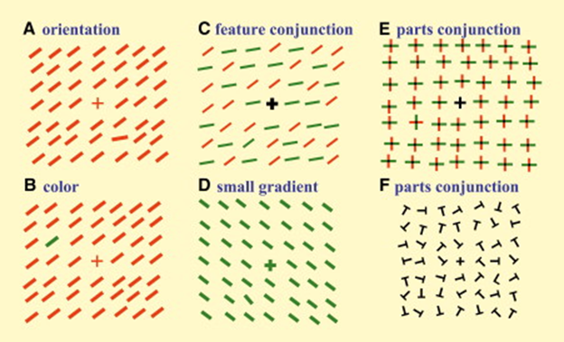
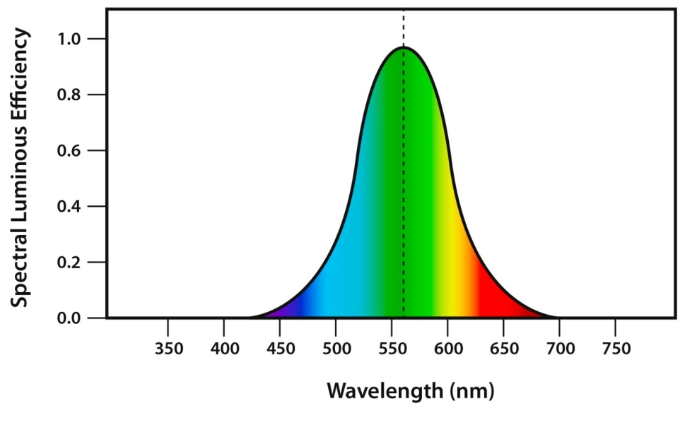

```{r setup, include=FALSE}
knitr::opts_chunk$set(echo = FALSE)
library(ggplot2)
library(dplyr)
```

## Some announcements!
- New R-Ladies chapter in Den Bosch!

- We are looking for co-organizers!

- We are looking for funding!

## Why are some plots easier to read than others?
Vision doesn't come for free.  One whole lobe of our brains (occipital lobe, in the back) is dedicated primarily to processing what we see. 

Humans are good at:

- Seeing adjacent light/dark contrasts

- Seeing angles of lines

    - Why: Early parts of the visual stream are dedicated to contrast & orientation
  
  
- Telling that one thing is very big

- Finding one relevant detail at a time

    - Why: The eye only sees 5 degrees of visual angle at a time, & the brain fills in the rest
  
    - Highest acuity = 1-2 degree spot (=1-2 thumb widths at arm's length)

## The role of visual attention
Your brain binds discrete visual properties together to show you a cohesive world.

Combinations of things -- relations -- take cognitive work.

 - Make plots as simple as possible to convey the required information.

Single features like color, orientation (A,B,D) lead to 'pop-out' unlike feature combinations (C,E,F)
 
 - Use single shapes, not relations between them (line plots > bar plots)

 


## Color can also be mis-percieved

 - Even a person with perfect color vision percieves green best.

{width=400px}

 - And 8% of people have anomalous color vision.

{width=400px}

## So, what to do?
Make a plot that is as simple as possible but portrays the data *accurately*


- Convey main trends, and also variability around them

    - Use color to emphasize main points. Use grey to emphasize contrast set.


- Don't make the reader use relational reasoning

    - Portray changes as lines. 

    - Make important comparisons nearby in the plot, so the relational reasoning is easier.
    

- Don't force the reader to make impossible color contrasts

    - Red vs blue, or light vs dark > red vs green, light vs also light
    
    - see [colorbrewer](http://colorbrewer2.org/#type=diverging&scheme=BrBG&n=3) for pretty palettes that can be colorblind safe and printer friendly
    

## How to choose your plot?
Here's a nice infographic of many plotting options:

	www.ft.com/vocabulary
	

For our purposes, focus on graphs for:

 - Correlation

 - Time series (change over time)

 - Distribution

 - Part-to-whole (bar plots and the like)
	
Data are all in-built R datasets.  See data() for more info!
(If you have ggplot2 downloaded, you should be able to run this code)

## Correlation plots
These ask the question:

"How does Y change as a function of X"?

(Relationship between two or more linear variables)

## Scatterplot
X vs Y
```{r splot1, echo = TRUE}
ggplot(data=iris,aes(x=Sepal.Length,y=Sepal.Width,color=Species)) +
  geom_point() + theme_classic() + 
  ggtitle("Sepal length and width by iris species") +
  ylab("Sepal Width") + xlab("Sepal Length")

```

## Bubble plot
X vs Y and Z
```{r bplot, echo = TRUE}
ggplot(data=iris,aes(x=Sepal.Length,y=Sepal.Width,
                     size=Petal.Length,color=Species)) +
  geom_point() + theme_classic() + 
  ggtitle("Sepal length and width by iris species and petal length") +
  ylab("Sepal Width") + xlab("Sepal Length")

```


## Heatmap
Z as a function of X and Y
```{r heat, echo = TRUE}
  quakes2 <- quakes %>% 
      group_by(lat=round(lat,0),long=round(long,0)) %>% 
       summarise( n=n() )

ggplot(quakes2, aes(y=lat, x=long,fill=n)) +
 geom_tile()+ theme_bw() + 
  ggtitle("Earthquakes near Fiji") +
  xlab("Longitude") + 
  ylab("Latitude")+
  scale_fill_gradient(low="yellow", high="red")
```


## Time series
Asks the question "how does Y change over units of time X?"

Uses connected lines, sometimes also points underneath

A special case of the correlation plot

##Time series
Y over time X
```{r timeseries, echo=T}
ggplot(data=as.data.frame(WorldPhones),
       aes(x=Europe,y=as.numeric(row.names(WorldPhones)))) +
  geom_point() + geom_line() + theme_classic() +
  ggtitle("Numbers of telephones in Europe by year, 1959-1961") +
  ylab("Year") + xlab("Number of phones in Europe")

```


## Distribution plots
Asks the question: "How does X affect the distribution of values of Y"

This is a really common scientific question.

*When in doubt, choose a distribution plot.*

##Violin
Distribution of Y over X
```{r violin, echo=T}
ggplot(data=sleep, aes(x=group,y=extra)) +
  geom_violin(draw_quantiles=c(.25,.5,.75))+ 
  geom_jitter(width=.01,alpha=.5)  + theme_classic() +
  ggtitle("Improvement in sleep quality with medication") +
  ylab("Improvement over baseline (hours)") + xlab("Drug condition")

```

##Box plot
Distribution of Y over X
```{r box, echo=T}
ggplot(data=sleep, aes(x=group,y=extra)) +
  geom_boxplot()+ 
  geom_jitter(width=.01,alpha=.5)  + theme_classic() +
  ggtitle("Improvement in sleep quality with medication") +
  ylab("Improvement over baseline (hours)") + xlab("Drug condition")

```

##Density plot
Distribution of Y over X
```{r density, echo=T}
ggplot(data=sleep, aes(x=extra,fill=group)) +
  geom_density(alpha=.5)+  theme_classic() +
  geom_vline(xintercept=0)+
  ggtitle("Improvement in sleep quality with medication") +
  xlab("Improvement over baseline (hours)") + ylab("Density")

```

##Histogram
Distribution of Y over X
```{r hist, echo=T}
ggplot(data=sleep, aes(x=extra,fill=group)) +
  geom_histogram(alpha=.5,position="identity",binwidth=.5)+  theme_classic() +
  geom_vline(xintercept=0)+
  ggtitle("Improvement in sleep quality with medication") +
  xlab("Improvement over baseline (hours)") + ylab("Counts")

```

## Part to whole
Question:
"How does the value of Y change between categories of X"

(*Only* appropriate for categorical variables)

- Pie charts can be quite confusing, unless you've got one very clear majority.

    - This is because they require relational comparisons

- Bar plots / stacked bar plots are OK for proportion data

    - Ok to hide nuances
	
    - Simple plot is fast and easy to perceive

- Bar plots are not good for other types of data

    - Sometime simple is not a good representation of the data
  
    - Overstates conclusions that aren't really there


##BarBarplots
This plot isn't terrible.  The data have a meanigful zero, and the range does start around there.  But, the boxplot is as easy to read and portrays more information!
```{r barbar, echo=T}
sleep2 <- sleep %>% group_by(group) %>%
  summarise(mExtra = mean(extra),seExtra=sd(extra)/sqrt(n()))%>%
  mutate(seD = mExtra - seExtra,
        seU = mExtra + seExtra)

ggplot(data=sleep2, aes(x=group,y=mExtra)) +
  geom_bar(stat="identity")+ geom_errorbar(aes(ymin=seD,ymax=seU),width=.5)+
  theme_classic() +
  ggtitle("Improvement in sleep quality with medication") +
  ylab("Improvement over baseline (hours)") + xlab("Group")

```  


##Ok Barplots
Here's a subtle improvement: tabulate the data so that we plot the proportion of individuals with improved sleep quality by group.  If that's the actual question we're interested in, this might be the right plot.  Why:  The data all exist between 0 and 1, which are the limits on the scale. 
```{r okbar, echo=T}
sleep3 <- sleep %>% group_by(group) %>%
 mutate(Improved = ifelse(extra > 0, 1, 0)) %>%
 summarise(mImp = mean(Improved), seImp=sd(Improved/sqrt(n()))) %>%
  mutate(seD = mImp - seImp,
        seU = mImp + seImp)


ggplot(data=sleep3, aes(x=group,y=mImp)) +
  geom_bar(stat="identity")+
  geom_errorbar(aes(ymin=seD,ymax=seU),width=.5)+
  theme_classic() +
  ggtitle("Improvement in sleep quality with medication") +
  ylab("Proportion users with improvement over baseline") + xlab("Group")

```  

##Sum-up
 * There are many plot options, play around with them!
 * Portray variability when you can, but also tell a clear story
    + use greyscale, alter alphas, add trend lines, other 'shorthands'
    + adding points is a great way to show variability, but sometimes can be overwheliming
 * When in doubt: defualy to a density plot or a violin.
